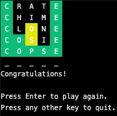

# Wordle CLI

>| Author | Email |
>|-------------|-------|
>Jack McVeigh | <jmcveigh55@gmail.com> |

# Overview
Wordle CLI is a clone of the New York Time's popular game [Wordle](https://www.nytimes.com/games/wordle/index.html). Created to explore python's curses module, this clone contains all features on the original, right in your terminal.



# Install
To install wordle-cli, run the following in the project directory:
```bash
pip3 install .
```

# Use
Play Wordle in your terminal by running the following:
```bash
wordle-cli
```
To play with hard mode enabled:
```bash
wordle-cli -H
```
OR
```bash
wordle-cli --hard
```

# Uninstall
To uninstall wordle-cli, run the following:
```bash
pip3 uninstall wordle-cli
```